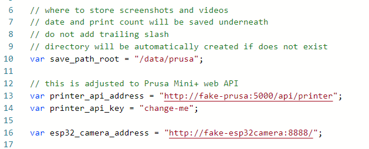

# prusa-esp32-node-red-time-lapse

Taking time lapse videos from Prusa prints using esp32 camera and Node-RED.

## Versions

Current v2 version is on master branch and uses custom gcode to trigger images.

For previous version see branch [v1](https://github.com/nvtkaszpir/prusa-esp32-node-red-time-lapse/tree/v1),
but notice this is not maintained anymore.

## About

Using custom gcode printer triggers button with every new layer.
Pressing the button sends message from esp32 to MQTT topic.
When message from specific topic is received then it triggers flow in Node-RED.
In the flow there is a check if the printer is printing, and thus
it takes picture via web from esp32 camera, and stores it in local directory.
If the print of the printer stops then it triggers rendering images into a mp4 video.

**See [docs/README.md](docs/README.md) for detailed instructions**

[timelapse with gcode](https://github.com/nvtkaszpir/prusa-esp32-node-red-time-lapse/assets/1480252/b3dc6f0d-3318-41ae-8bcf-081d0ebd0208)

## What works

- trigger button via custom gcode
- trigger flow when button is pressed
- trigger video render if printer was printing and stopped printing
- Node-RED + mqtt in containers (docker), can also run directly on host
- logic flow - capturing images to directory if printer is printing
- rendering images into a movie using ffmpeg within node-red container
- now whole process is within single flow, and you can run multiple flows if you have different printers/cameras
- you can define default values per flow such as destination directory, printer address, camera address
- if day change is detected (via UTC) then print counter is reset to zero after current print is finished
- fetch image from camera only once
- ffmpeg in container + shell script to merge images into a mp4 file
- basic web ui dashboard, it's crap but provides core info :)

- default docker-compose spawns fake prusa api and fake esp32 camera,
  this is great to test flows and adjust them without need of using real hardware
- fixed issues with out of order frames

## Known limitations

- due to using custom gcode it takes a bit time to tune button triggering,
  but you can manually trigger flow in Node-RED.
- if you have print in the bed corner close to where power connector is attached to bed,
  then it can trigger button presses and thus extra image captures,
  that's why it is better to adjust print area to avoid movements in that space, if possible.
- if you deploy node-red flow then counter for daily print is reset,
  which results in files to be saved in already existing directories and video
  may not be rendered because it already exists, or it will be merged from
  old and new images (depends on the timelapse script options)
- you MUST configure node `general config` under `on Startup` and set vars there

- screenshot taking/stopping and video render have some delay, this is intentional,
  first, it allows to add 'final' frame when printer head is away from print,
  second, it allows to not trigger actions on failed messages
- before rendering videos there is not much info on the dashboard
- video progress is showing yellow dot on the dashboard only if ffmpeg runs for over 10s
- can not get rendered video from the dashboard - out of scope - use other flows for that,
  there is one that allows to browse files via web ui,
  or just mount data dir as samba share etc, see below
- if camera fetch error occurs there is no retry to fetch it,
  this is rather not an issue because ffmpeg will automatically detect incorrect images
  and will not add them to video
- rendered images and videos are not cleaned up, you must manage data dir on your own

## NOT-TODO

Things that will not going to happen:

- adding code to list files for render videos/images in web ui;
  there are other better solutions there such as
  [Csongor Varga code](https://flows.nodered.org/flow/44bc7ad491aacb4253dd8a5f757b5407)

## TODO

- save daily print counter state to avoid writing to existing directories
- detect camera errors + add retry
- detect bad camera captures + add retry

- how to deal with the corner case when printing very close to the button - use gcode
  to trigger on-board pins, is is supported by Prusa Mini?

## Future plans

Currently project fulfills the needs I wanted.

Recording some videos has this issue that print head movement is sometimes annoying
and the only way to fix it is to use custom gcode to move print head per layer to specific place
and then trigger an image capture.

Above can be done with physical button attached to esp32 which will trigger node-red
event that will trigger the flow to capture image.

Still, this option is less invasive for me than other options like octoprint, because
it requires only injecting specific gcode per layer.

Benefits:

- taking photo per layer and not every 10s when printing in some random location
- no more moving print head
- you can place print bed in desired position for example all forward
- no need to attach esp32 camera to print bed - no more blurred images due movement,
  and esp32 camera can be in one static spot, so the occupied space by printer is lower

Disadvantages:

- more complex - needs gcode, physical button (magnet triggered is the safest one),
  extra esphome code and node-red mqtt event node or similar
- slightly slower print - due gcode and extra print head/bed moves
- stringing - due gcode it may produce more filament strings, needs to adjust retraction
  for that phase
