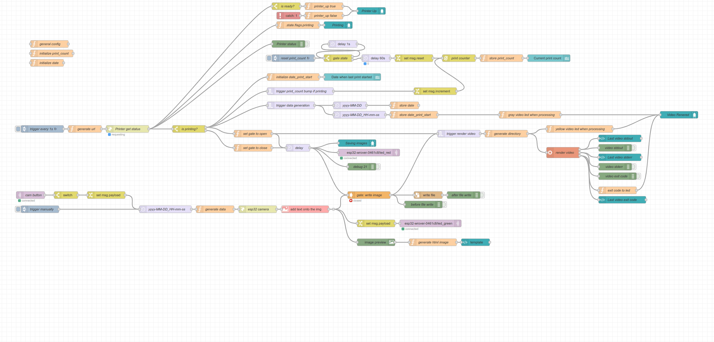
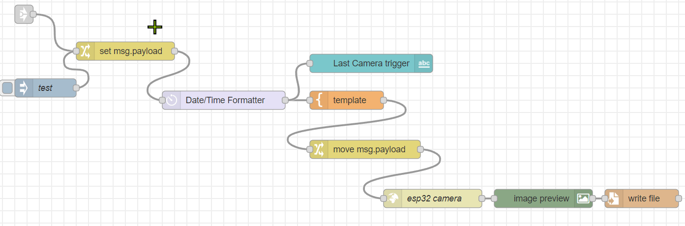
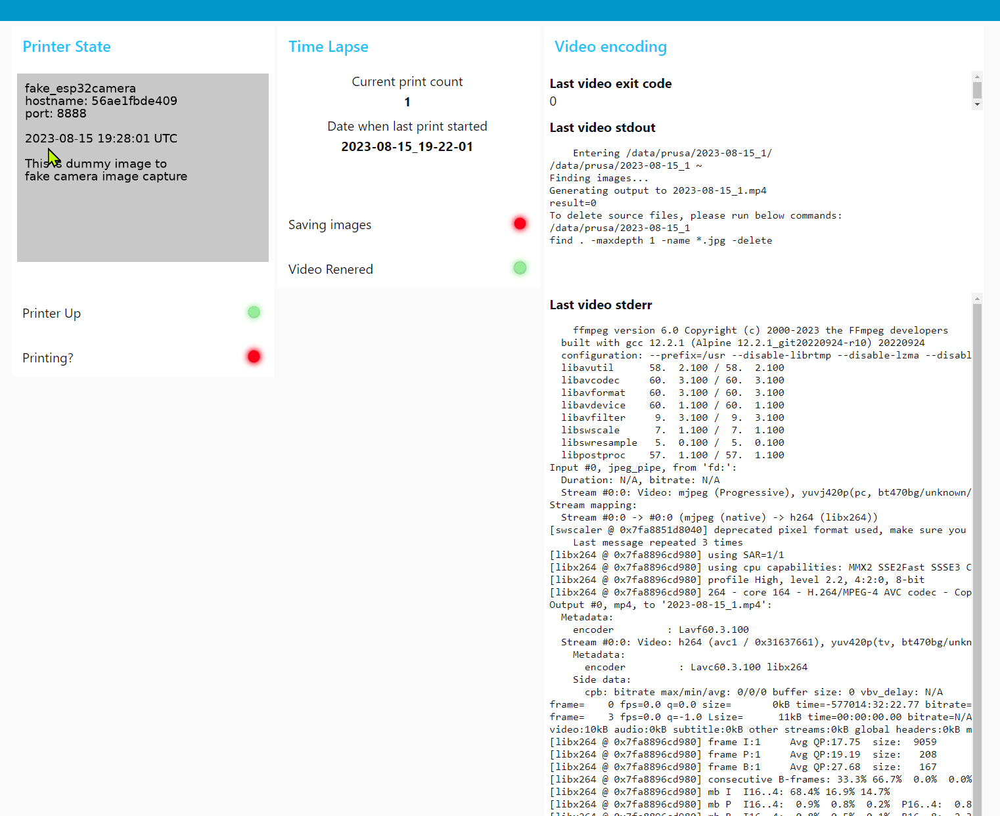

# prusa-esp32-node-red-time-lapse

Taking time lapse videos from Prusa prints using esp32 camera and node-red

Details:

- [Overview](docs/Overview.md)
- [Hardware Requirements](docs/Requirements.hardware.md)
- [Software Requirements](docs/Requirements.software.md)
- [Configuring esp32](docs/Configuring.esp32.md)
- [Configuring printer](docs/Configuring.printer.md)
- [Configuring host](docs/Configuring.host.md)
- [node-RED Flow](docs/Configuring.node-red.flow.md)
- [Further steps](docs/Further.steps.md)

https://github.com/nvtkaszpir/prusa-esp32-node-red-time-lapse/assets/1480252/9d08c0c2-bd34-430f-b20b-ba48656a8d91

## What works

- node-RED + mqtt in containers (docker), could be run directly on host
- logic flow - capturing images to directory if printer is printing
- rendering images into a movie using ffmpeg (externally executed)

## Known limitations

- could be as one flow, right now camera image is fetched twice
- only one printer/one camera is supported - would require better modularization

- all images are dumped into one directory, I'm planning to add variable to
  detect if the print is happening and when it started to create directory
  and store images there - easier to manage if printing more than one thing in
  a sequence

- due to the fact I run it in container which does not have ffmpeg I need to
  manually execute script to merge images into a video, I bet that can be fixed
  by just installing ffmpeg within container but for now I wanted to avoid it.
  Will do updates later on

- basic web ui dashboard, it's crap but provides core info :)

