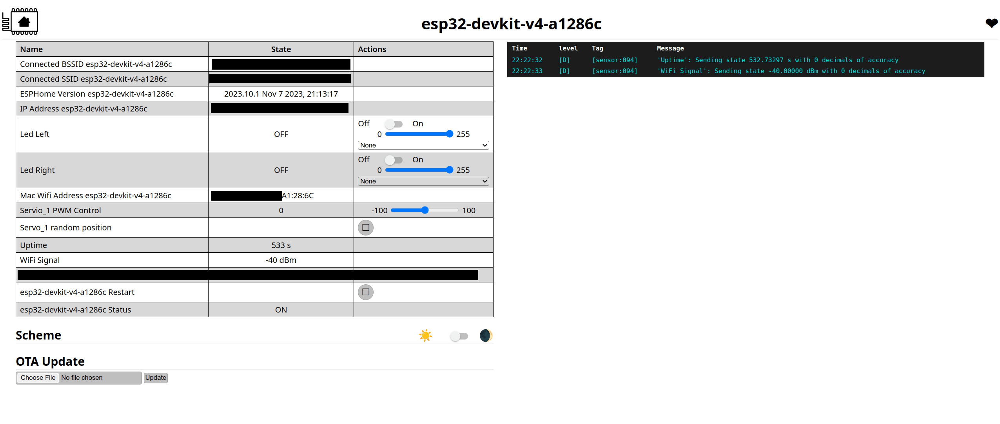

# Configuring esp32

## First install

- prepare esp32 device and USB cable

- initiate esp32 installation using [esphome web](https://web.esphome.io/)

- connect your device to the usb cable and into the computer

- press `Connect` in esphome web, wait until it configures the device

## Run esphome

- the easiest is to run container with esphome and use it for device config,
  notice that docker-compose in the project already has it added

- go to the esphome dashboard on [0.0.0.0:6052](http://0.0.0.0:6052)
  and in top right corner press `secrets` and copy/paste there below section
  with updated values:

  ```yaml
  # Your Wi-Fi SSID and password
  WIFI_SSID: "your-wifi-ssid"
  WIFI_PASS: "your-wifi-password"
  DOMAIN: ".local"
  ```

  and then click `save`

- new device should show up - press adopt and configure it as in the next step

## Install firmware on the device

- press `Edit` on the device

- copy paste code from `../esphome/esp32-camera.yaml`

- edit entries such as device name, make sure to alter entries in `esp32_camera` section
  (depending on camera you need to change it) such as resolution etc.

- edit `GPIO12` if you used different pin for green led
- edit `GPIO13` if you used different pin for physical button
- edit `GPIO14` if you used different pin for red led
- edit `mqtt`.`broker` address to the corresponding address, especially if using different broker,
  this must be and address of the broker (DNS or IP address) which is reachable from esp32 device over the network,
  so if you run mqtt in docker then it must be the IP address of the host which runs mqtt container
  and must be reachable from wifi network that esp32 is connected to
- edit `esp32-wrover-0461c8/led_green` and `esp32-wrover-0461c8/led_red` mqtt topic to your needs,
  it must be the same as in Node-RED flow config

- check code for correctness and save it - esphome web ui should automatically do this

- install code over web, wait for code upload to the esp32 device

- go to esp32 address in your browser (`ESP32_CAMERA_ADDRESS`),
  check if port 80 shows esphome web UI - it should look something like below image

  

  check if device name `Status` shows `ON` (if yes then device is connected to MQTT broker)

- go to esp32 address in your browser (`ESP32_CAMERA_ADDRESS`),
  check if web address returns screenshot on port `8081`

- (after node-red flow deployment) check if pressing physical button triggers MQTT message and Node-RED flow,
  as a result green led should light up for a moment.
