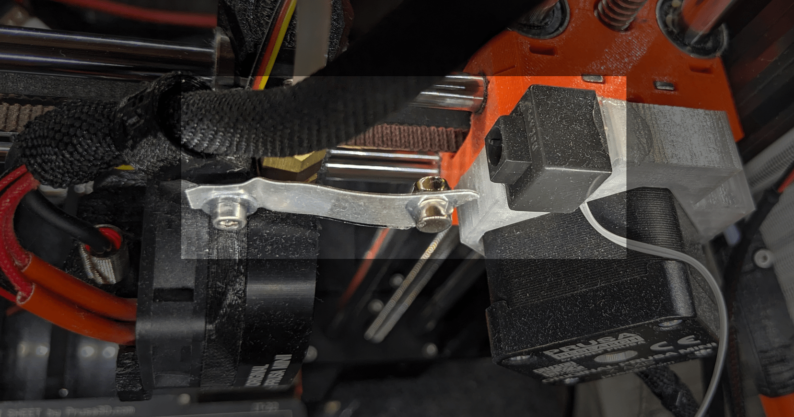
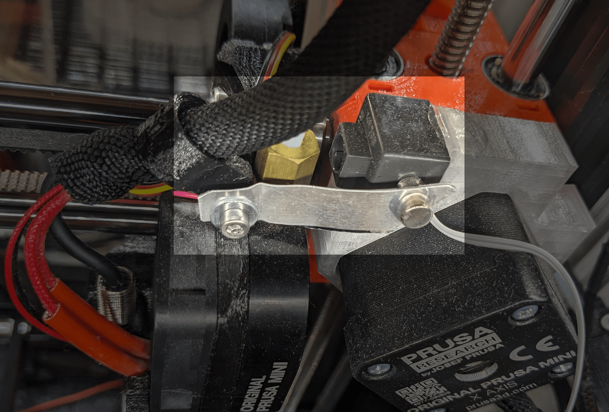

# Preparing hardware

Connecting cables to the devices may require soldering,
especially to button and LED legs.

## Button

- attach jumper wires to the physical button,
  watch out which connectors you use, because some have common mass

- attach physical button to the `GPIO13` and any `GND` pin on esp32

- attach button to the printer body so that print movement will trigger
  its action.

- if using reed switch then attach magnet to the print head, can be a metal
  or plastic strip screwed to the print head, and magnet on the end of the strip.

  

  

  notice the mighty power of hot glue :)

- if using limit microswitch it may require printing switch mounting,
  for Prusa Mini you may be interested in [my step motor brace](https://www.printables.com/model/581008-prusa-mini-step-motor-brace-with-45deg-block)

## Signaling LEDs

- attach resistors to color LEDs
- attach jumper wires - connect LED cables to the esp32, make sure you do not mix polarity
  (note to self - `flat spot` to the `ground`) [wikipedia](https://commons.wikimedia.org/wiki/File:LED,_5mm,_green_(en).svg)
- `GPIO12` pin for green led
- `GPIO14` pin for red led
